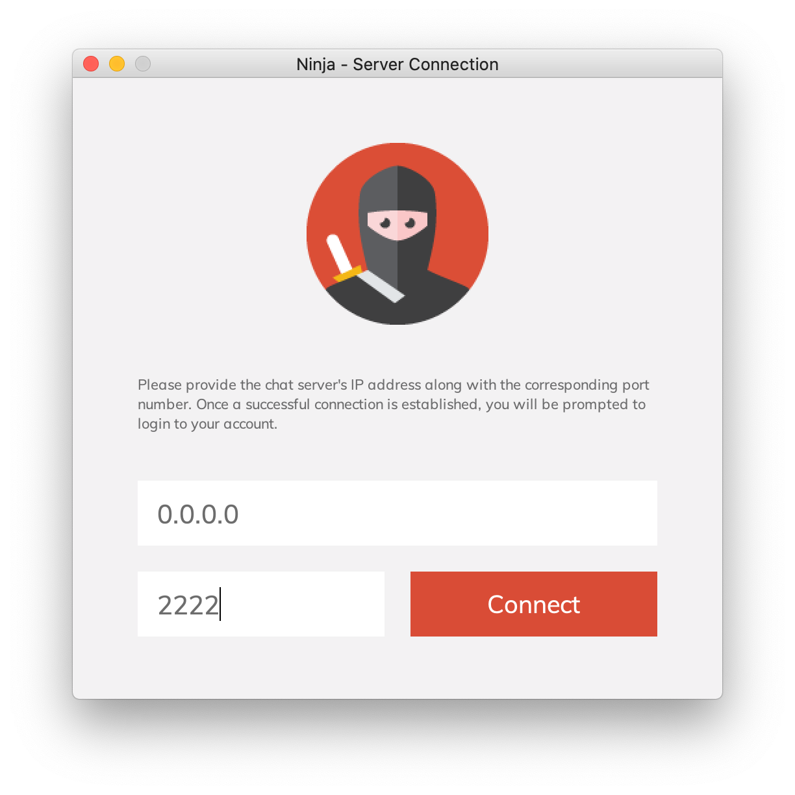
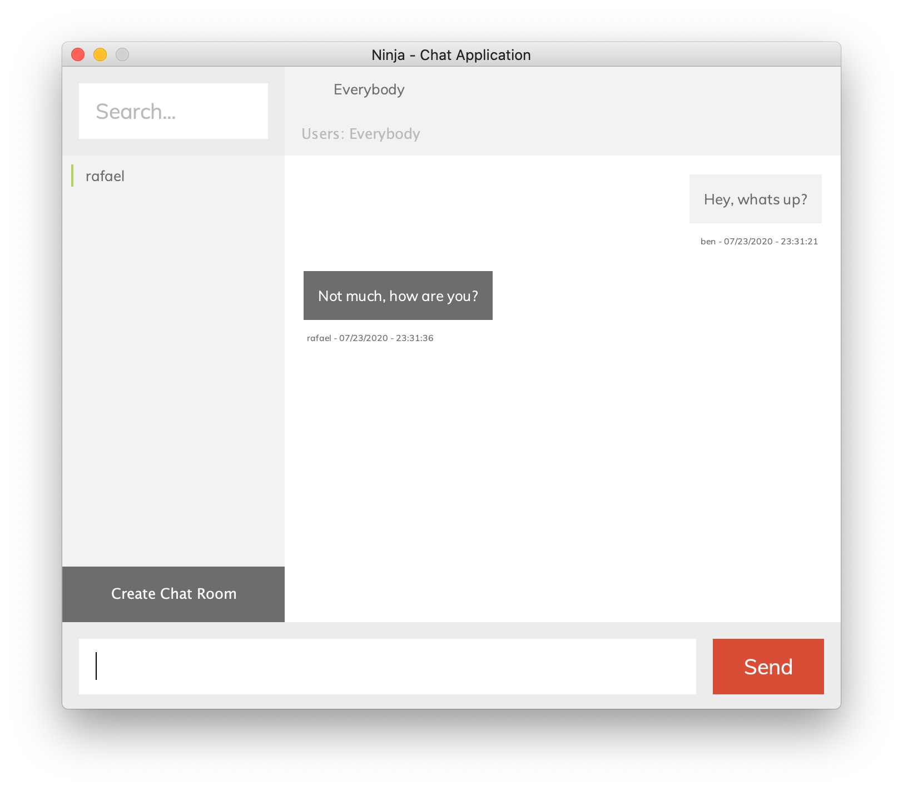

# Ninja – Chat Application


<p align="center" >
	
	
</p>

### About

Made for project #4 for course CS342 (Software Design) at the University of Illinois at Chicago. This application was made by Rafael Grigorian & Ben Gansukh. The original project prompt can be found [here](docs/prompt.pdf). This application is a simple chat application with a server side and a client side. Chatting with everyone, custom groups, and one-on-one is possible with this application and are managed with tabs.

### Building & Running

This project uses maven as a build system. Therefore to package this library into a jar, execute `mvn package` while in the project root directory. This will package the application into the `target` folder. A server process needs to be run somewhere and then a client process needs to be run to join. The default server port for this application is `2222`. See example below:

```shell
# Package application
mvn package
# Run server process
java -cp target/ninja-1.0.0-jar-with-dependencies.jar edu.uic.cs342.ninja.Ninja server
# Run client process
java -cp target/ninja-1.0.0-jar-with-dependencies.jar edu.uic.cs342.ninja.Ninja client
```

Once the client process runs and the GUI appears, you can connect to the server using the IP address and the default port (2222). Then you can create an account or login to an existing one. All data appears in the `data` folder relative to where the server process is running.

### Bugs / Feature Requests

If you have any feature requests, please open up an issue. Similarly if there are any bugs found, please report them by opening up an issue.  If a bug is found, please include steps to reproduce the issue, alongside the expected and actual behavior.
